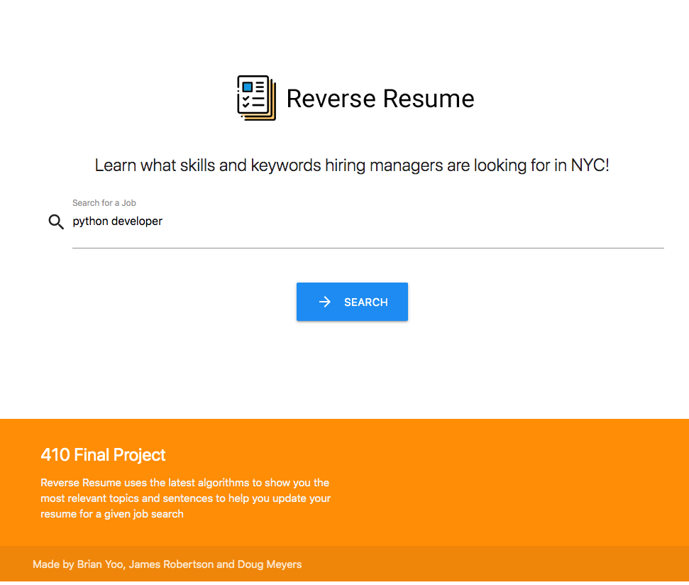
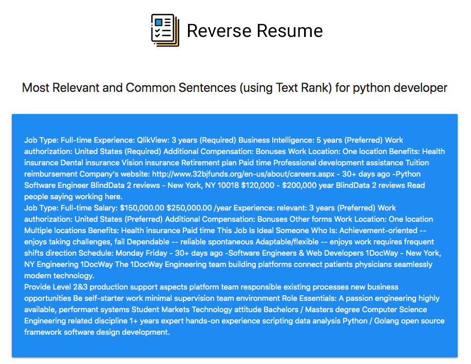
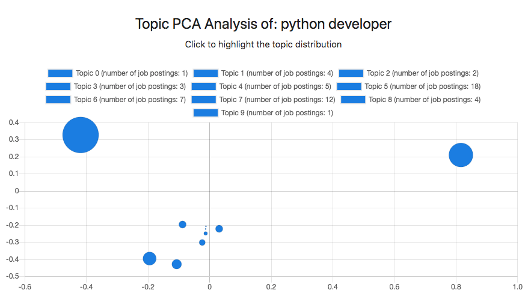
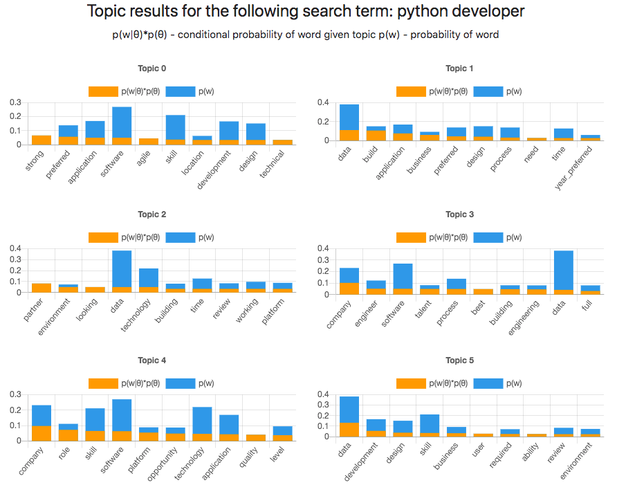

# Text-Info-Systems-Project
 
## Overview

Reverse Resume helps users learn what are the most relevant skillsets and keywords that hiring managers are seeking.  Users can use these insights to tailor their resume, so they are better market fit or build out the desired skillset through training or higher education.

Users simply enter in the job position they are interested in pursuing (‘Python Developer”), click search and Reverse Resume will scrape 100+ job descriptions from Indeed.com and run various text analysis models to return a summary and visualization of the most relevant sentences, key topics and analyatics on how related the topics are.  


## Team Members and Contributions

- Doug Meyers: Modified the class HW webscraping code for Indeed.com, coded procedure for Data Cleaning, adopted test code for LDA and Text Rank from gensim package, Flask Integration with Chart JS, Contributed to Documenation and Video
- James Robertson:
- Brian Yoo:

## Dependencies

Webscraping packages
- [beautiful soup](https://www.crummy.com/software/BeautifulSoup/)
- [selenium](https://selenium-python.readthedocs.io/installation.html)
- [chromedriver](https://chromedriver.chromium.org/)

Data Wrangling packages
- [pandas](https://pandas.pydata.org/)

Text mining/ML packages
- [scikit-learn](https://scikit-learn.org/stable/) - package used for machine learning
- [nltk](https://www.nltk.org/install.html) - package used for natural language processing and document processing
- [gensim](https://radimrehurek.com/gensim/) - package used for topic modeling

Visualization packages
- [pprint](https://docs.python.org/3/library/pprint.html)
- [matplotlib](https://matplotlib.org/)

Web Framework packages
- [flask](https://www.palletsprojects.com/p/flask/)


## Installation

### Conda Installation
```
conda create --name reverseresume python==3.6
conda install --file requirements.txt 
source activate reverseresume
```

### pip Installation
```
pip install -r requirements.txt --no-index --find-links file:///tmp/packages
```


### Download Wordnet Lexical Database
```
Open up your python console
Type 'import nltk' and 'nltk.download('wordnet')'
Close the python console
```


## Usage

Run the app:
```
python main.py
Access the page on this URL: http://127.0.0.1:5000/
** If you get a selenium web driver or chrome error after your first search you may need to upgrade your chrome driver using this link:
https://chromedriver.chromium.org/downloads

```

Search a job (e.g., python developer)

<p align="center">

</p>

<br/>
And that's it! Keep in mind that the query will take some time (usually several minutes) to load.

<br/>

## Query Results

The query results will return a 250 word limit summary of the most relevant sentences obtained from the job postings. The relevance of sentences are based on the [TextRank algorithm](https://arxiv.org/abs/1602.03606).

<p align="center">

</p>

<br/>

Reverse Resume uses Latent Dirichlet Allocation (LDA) to create its topic model. As such, we perform principle component analysis (PCA) of the topic coverage to provide some idea as to how each topic varies from one another. Each bubble in the chart represents a topic. The size of each bubble is determined based on the number of job postings for a given topic.

<p align="center">

</p>


<br/>

Finally, Reverse Resume provide a chart of word distributions of relevant keywords for each topic. The probability for each word within
a topic is compared with the probability of the word in the entire corpus.


<p align="center">

</p>
