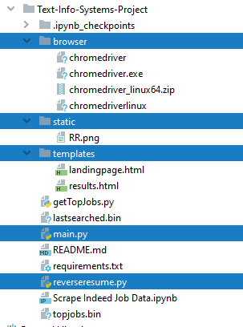

# Text-Info-Systems-Project
 
## Overview

Reverse Resume helps users learn what are the most relevant skillsets and keywords that hiring managers are seeking.  Users can use these insights to tailor their resume so they are more attractive to job market or build out the desired skillset through training or higher education.

Users simply enter in the job position they are interested in pursuing (‘Python Developer”), click search and Reverse Resume will scrape 100+ job descriptions from Indeed.com and run various text analysis models to return a summary and visualization of the most relevant sentences, key topics and analytics on how related the topics are.  


## Team Members and Contributions

- Doug Meyers: Modified the class HW webscraping code for Indeed.com, coded procedure for data cleaning, adopted test code for LDA and Text Rank from Gensim package, Flask integration with Chart JS, and contributed to documenation and video.
- James Robertson: Migrated codebase from Jupyter notebook into Class object and API, contributed to documentation, created video and made all final cuts
- Brian Yoo: Performed EDA for LDA model, created PCA/probability diagrams and data pipelines for Chart JS figures, contributed to documentation and video

Note: All group members contributed 20+ hours to the project.

## Dependencies

Webscraping packages
- [beautiful soup](https://www.crummy.com/software/BeautifulSoup/)
- [selenium](https://selenium-python.readthedocs.io/installation.html)
- [chromedriver](https://chromedriver.chromium.org/)

Data Wrangling packages
- [pandas](https://pandas.pydata.org/)

Text mining/ML packages
- [scikit-learn](https://scikit-learn.org/stable/) - package used for machine learning
- [nltk](https://www.nltk.org/install.html) - package used for natural language processing and document processing
- [gensim](https://radimrehurek.com/gensim/) - package used for topic modeling

Visualization packages
- [pprint](https://docs.python.org/3/library/pprint.html)
- [matplotlib](https://matplotlib.org/)

Web Framework packages
- [flask](https://www.palletsprojects.com/p/flask/)
- [materlize css](https://materializecss.com/)
- [jquery](https://jquery.com/)

## Installation

### Conda Installation
```
conda create --name reverseresume python==3.6
conda install --file requirements.txt 
source activate reverseresume
```

### Pip Installation
```
pip install -r requirements.txt --no-index --find-links file:///tmp/packages
```


### Download Wordnet Lexical Database
Open up your python console
```
import nltk
nltk.download('wordnet')
```

## Software Implementation   



- main.py: This is the main python application that runs the flask website and calls the reverseresume class which contains the majority of the business logic.  PCA was also implemented in this file.
- reverseresume.py:  This python file class contains the code used to scrape Indeed.com and implementes the various gensim text models to run text rank and LDA. 
- templates dir:  This directory contains the html and javascript files used to render to search landing page and the results.
- browser dir:  This directory contains chrome drivers for linux, windows and mac operating systems.
- static dir:  This directory contains static html and image files.
## Usage

Run the app:
```
python main.py
```
Access the page via URL: http://127.0.0.1:5000/

** If you get a selenium web driver or chrome error after your first search you may need to upgrade your chrome driver using this link:
https://chromedriver.chromium.org/downloads
The chrome drivers are in the browser directory


Search a job (e.g., python developer)

<p align="center">

</p>

<br/>
And that's it! Keep in mind that the query will take some time (usually several minutes) to load.

<br/>

## Query Results

The query results will return a 250 word limit summary of the most relevant sentences obtained from the job postings. Gensim's TextRank summary is created by first placing all sentences from the corpus into a graph data structure, where each sentence represents a node on the graph. The edges of nodes are then generated using a similarity function, such as those used in text retrieval processes (for instance, BM25, BM25+ and cosine similarity). Once this graph structure is created, Google’s PageRank algorithm is used to score each sentence. The sentences that have the highest score are the ones that show up on the summary. More detail on the algorithm can be found [here](https://arxiv.org/abs/1602.03606). 

<p align="center">

</p>

<br/>

Reverse Resume implements gensim's Latent Dirichlet Allocation (LDA) API to determine the most likely topic a document is categorized as. LDA is a generative model and the Bayesian form of the Probabilistic Latent Semantic Analysis model, which can be used to categorize documents based on their topics, where each topic is defined as a distribution of words. Keep in mind that documents can be associated with multiple topics, although for the following chart, we only label each document based on their most probable topic. 
  
In the figure shown below, Principle component analysis (PCA) is performed on the topic coverage matrix to provide some idea as to how each topic varies from one another. Principle component analysis or PCA is a very common dimensionality reduction technique, where each component corresponds to the vector which minimizes the covariance of the dataset. Here each of the axes correspond to the first and second principle component of the topic coverage matrix, wherein each element this matrix corresponds to the probability of document topic. Likewise, each bubble in the chart represents a topic. Bubbles or topics that are farther apart, particularly along the x-axis or the first principle component, tend to differ more so than those closer to each other. One thing to note is that PCA is a dimensionality reduction technique that works well for linearly correlated data, and not necessarily well for nonlinearly correlated data. For visualization purposes, we have grouped all documents belonging to the same topic and have taken the mean x and y coordinates and plotted the size of the bubbles based on the number of documents belonging to that topic. 
  


<p align="center">

</p>


<br/>

Finally, Reverse Resume provide a chart of word distributions of relevant keywords for each topic. Here we show the product of the conditional probability of words given the topic (p(w|&theta;)) with the probability of the topic (p(&theta;)), and compare them to the probability of the word (p(w)) for the entire corpus. The point of these charts it to show which words tend to be most relevant for each topic.


<p align="center">

</p>


## API USAGE

We wanted to mark our python API as simple as possible.

```python
>>> import reverseresume as rr
>>> resume=rr.ReverseResume()
Reverse Resume Beta
>>> for i in dir(resume):
...     if "_" in i:
...             pass
...     else:
...             print(i) #printing available methods and functions.
... 
alldocs #all documents found in web scrape
browser #web crawler
cache 
cleanClose #close crawler
corpus #rr corupus
dictionary #genism dictionary
getBrowser #loads OS specific browser
id2word #dictionary of worsd
importPackages #package preloader
keywords #search keywords
lda #Latent Dirichlet allocation
pca #Principle component analysis
platform #your os platform
run #run reverse resume
summary #summary of documents
today #todays date for cachine
verbose #flag to set verbose output. True = output all comments; False = Silent run.

>>> resume.run('Machine Learning', 'San Francisco, CA')
Scraping 55 job links.ound 19 indeed search urls 
Accessing link 12 of 55  
Scrape Complete.     
Summarizing Findings.
Number of unique tokens: 95
Number of documents: 55
>>> resume.summary
['Job Type: Full-time Salary: $125,000.00 $190,000.00 /year Additional Compensation:
Other forms Work Location: One location Fully Remote Benefits: Health insurance
Dental insurance Vision insurance Retirement plan Paid time Flexible schedule Parental leave
Relocation assistance Professional development assistance Visa Sponsorship Potentially Available: 
Yes: H-1B work authorization Yes: Other non-immigrant work authorization (e.g. L-1, TN, E-3, O-1, etc.)
This Job Is Ideal Someone Who Is: Detail-oriented -- focus details work bigger picture 
Achievement-oriented -- enjoys taking challenges, fail Innovative -- prefers working unconventional ways tasks require creativity This Company Describes Its Culture as: Innovative -- innovative risk-taking 
People-oriented -- supportive fairness-focused Team-oriented -- cooperative collaborative 
This Job Is: A job military experienced candidates encouraged apply Open applicants 18 years 
old, provided legally allowed job location Open applicants high school diploma/GED 
A Fair Chance job (you employer follow Fair Chance hiring practices performing 
background checks - learn https://start.indeed.com/fair-chance) A good fit 
applicants gaps resume, workforce past 6 months A good job entering workforce 
returning workforce limited experience education A job ages, including older 
job seekers, encouraged apply Open applicants college diploma A job people 
disabilities encouraged apply - 30+ days ago -Machine Learning/AI Researcher 
SCOTTY San Francisco, CA Our machine learning specialists design develop 
cutting edge algorithms enable vehicles adapt improve gather increasing amounts data.']

>>> resume.keywords
[('customer', 0.004588123746779739), ('unity', 0.004400491868799696), ('glassdoor', 0.0039294060401766015), 
('twitter', 0.0031667825440864403), ('gsk', 0.0026901086699553972), ('insurance', 0.0025779367352851616),
('go', 0.002430043335379156), ('learning', 0.00236669154869136), ('trueaccord', 0.00233555294865534),
('job', 0.002104016677961451), ('company', 0.0020018867494534204), ('customers', 0.0019845589796946292),
('oriented', 0.001910258392465156), ('ml', 0.0019020157638575642), ('solution', 0.0019013688828864706),
('cruise', 0.0018620865024422959), ('talent', 0.0018513649381653877), ('strategic', 0.0017798724237761284),
('technical', 0.0017432869599994405), ('business', 0.0017194149335578888), ('edmodo', 0.0016438413145265828),
('you', 0.001604538176532733), ('machine', 0.0016000523112135129), ('process', 0.0015805962384064023),
('companies', 0.0015792855625811606), ('content', 0.0015153900912681546), ('we', 0.0014937257460633142),
('sonoma', 0.0014613393285227542), ('williams', 0.0014613393285227542), ('software', 0.0014609646490436562),
('development', 0.0014316742156920716), ('data', 0.0014311188138316304), ('search', 0.0013701936271412415),
('triplebyte', 0.001347999855638639), ('d', 0.0013458817348741784), ('product', 0.0013255605443591254),
('map', 0.0013015365960398165), ('users', 0.0012932203932961444), ('splunk', 0.001278946992433675),
('playstation', 0.0012669664865724286), ('aurora', 0.0012658049786871178), ('systems', 0.0012512645139294521),
('products', 0.0012360953270937822), ('self', 0.0012309241920592233), ('experience', 0.001230055286482236),
('internship', 0.0012263483482588616), ('members', 0.0011997286596267182), ('research', 0.0011587629950814595),
('nlp', 0.0011431507355680532), ('models', 0.0011365253060385632), ('problems', 0.0011321319975206787),
('solutions', 0.0011308809686198205), ('cortex', 0.0011168997430575985), ('our', 0.0011083076310878497),
('strategy', 0.001088305272377367), ('management', 0.0010786371256506688), ('cell', 0.0010743755000729323),
('drug', 0.0010743755000729323), ('great', 0.0010660681679374004), ('user', 0.0010651797842945899), 
('us', 0.0010502674141500924), ('food', 0.001041180647553374), ('algorithms', 0.0010380958982165235),
('deep', 0.00103699181059798), ('training', 0.0010368518376674728), ('images', 0.0010177130737459537),
('hiring', 0.0010013554056627003), ('driving', 0.0010013554056626998)]

```
